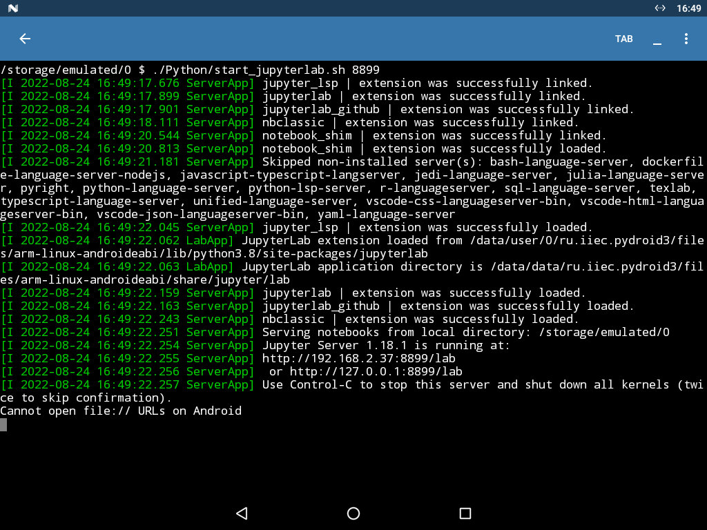
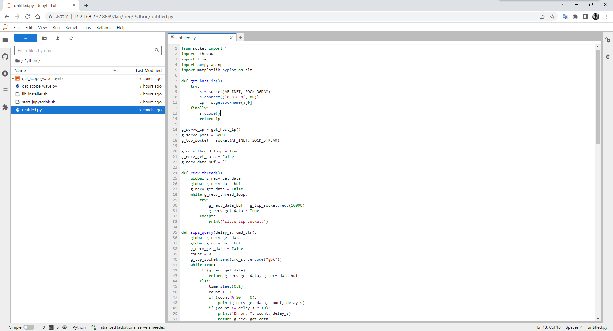

# jupyter-lab

[English](README.md) | 简体中文

[**SCPI_WiKi**](https://github.com/OWON-LILIPUT/jupyter-lab/wiki/SCPI)

## 一、下载Pydroid3离线库

1、访问 [谷歌网盘](https://drive.google.com/file/d/1LjAXf11ubn4tivQE7K1kL6wfOIgLjqmN/view?usp=sharing) 或者 [百度网盘](https://pan.baidu.com/s/1aID5IbcW23gGj2UfjrBmFQ?from=init  提取码： 0000) 下载 `Pydroid3` 离线库。

2、下载完成后打开机器的文件管理 `App` ，进入 `Android` 文件夹，在里面新建 `obb` 文件夹，新建完成后进入 `obb` 文件夹，在里面新建 `ru.iiec.pydroid3.quickinstallrepo` 文件夹。

3、将下载的离线库放入 `ru.iiec.pydroid3.quickinstallrepo` 文件夹即可。

## 二、安装jupyter和jupyter-lab库

1、将示波器连接到以太网。

2、打开 `Pydroid3 App` ，点击左上角菜单按钮，在弹出的菜单中点击 `Pip` 。

3、在 `Pip` 界面中点击 `QUICK INSTALL` ，在下方列表中分别找到如下的库并点击右侧的 `install` 进行安装。

```
jupyter    PyQt5    matplotlib    scipy
```

4、安装完成后点击左上角返回按钮返回主界面，然后再点击左上角菜单按钮，在弹出的菜单中点击 `Terminal` 。

5、在 `Terminal` 中输入以下命令来安装 `jupyter-lab` 相关库。

```sh
./Python/lib_installer.sh
```


## 三、配置jupyter-lab登录密码

1、返回App主页面，点击左上角菜单按钮，在弹出的菜单中点击 `Terminal` 。

2、在 `Terminal` 中输入以下命令来设置登录密码。

```sh
jupyter-lab password
```


## 四、浏览器访问jupyter-lab

1、使用如下命令启动 `jupyter-lab` ，`ip` 设置为本机的 `ip` ，`ip` 可自动选择，也可手动设置（`wifi` 和以太网同时连接时），端口自选一个可用的即可。

- 自动选择 `ip`

  ```
  ./Python/start_jupyterlab.sh 端口
  ```

  

- 手动设置 `ip`

  ```
  ./Python/start_jupyterlab.sh ip地址 端口
  ```


2、示波器本地访问，在浏览器输入如下网址

```sh
http://示波器ip:端口/lab 
```


3、局域网下电脑浏览器访问，输入如下网址

```sh
http://示波器ip:端口/lab 
```


## 五、运行示例脚本

1、运行 `GitHub` 代码：

- 使用浏览器进入 `jupyter-lab` ，点击左侧 `Github` 图标，在上方的 `GITHUB USER` 框中按 `用户名/仓库名` 的格式输入存放代码的仓库。例如 `OWON-LILIPUT/jupyter-lab` 。

- 在文件列表中选择你要运行的脚本双击打开即可运行。

  

2、运行本地预置代码：

- 使用浏览器进入 `jupyter-lab` ，点击左侧 `文件夹` 图标，在文件列表中找到 `Python` 文件夹，里面存放了一些预置脚本。

- 选择你要运行的脚本双击打开即可运行。

  


## 六、保存.py文件

1、使用浏览器进入 `jupyter-lab` ，在主页的 `Launcher` 底部即可看见创建 `py` 文件的按钮。


2、点击创建 `py` 文件后将调试好的代码复制粘贴进去保存即可。




## 七、运行.py脚本

1、打开 `Pydroid3 App` ，在主页右上角点击文件夹图标，在弹出的选项中点击 `Open` 。


2、在弹出的界面点击 `InternalStorage` 进入内部存储。


3、在内部存储中找到你保存的 `py` 文件点击即可打开。以示例代码为例，进入内部存储后点击 `Python` 文件夹，进入 `Python` 文件夹后点击 `get_scope_wave.py` 即可打开。


4、打开 `py` 文件后点击右下角运行按钮即可运行代码。


## 八、使用PyCharm开发PyQt

1、 Pycharm是由jetbrains开发的优秀的python IDE。正如所有其它 JetBrains 集成开发环境一样，PyCharm 具有智能代码编辑器，能理解 Python 的特性并提供卓越的生产力推进工具：**自动代码格式化**、**代码完成**、**重构**、**自动导入**和**一键代码导航**等。这些功能在先进代码分析程序的支持下，使 PyCharm 成为 Python 专业开发人员和刚起步人员使用的有力工具。

2、为了方便开发，可以再PyCharm上进行代码编写调试，完成后传输到机器上运行。

3、PyQt Demo运行示例


